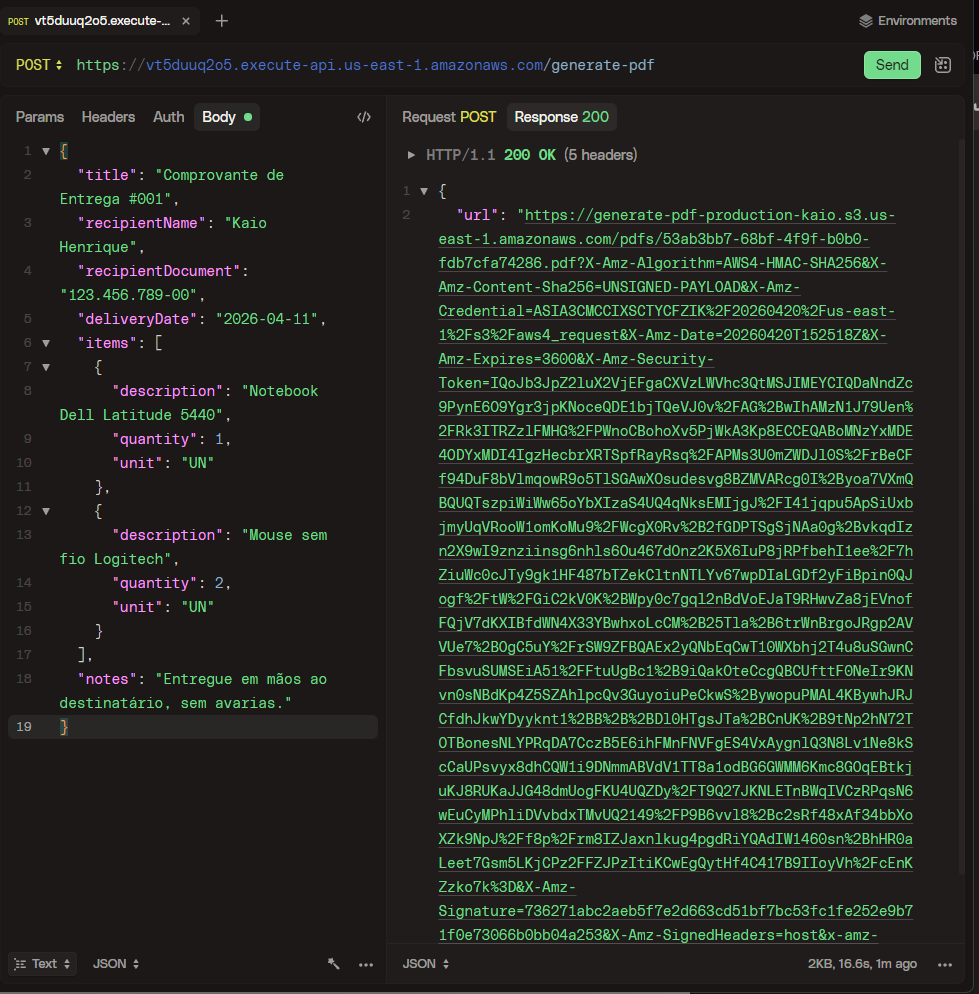
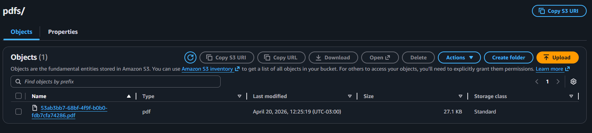
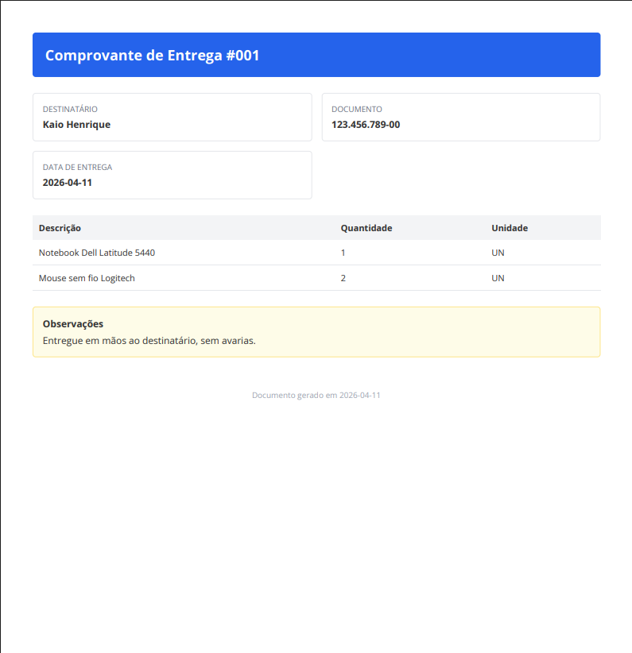

# PDF Generator API


API serverless para geracao de PDFs sob demanda com AWS Lambda, Puppeteer e Amazon S3.

O projeto recebe um payload HTTP com os dados do documento, gera um PDF a partir de um template HTML, faz upload do arquivo para o S3 e devolve uma URL temporaria para download.

## Visao Geral

### O que a API faz

- recebe dados estruturados via `POST /generate-pdf`
- valida o payload de entrada
- monta o HTML do documento
- gera o PDF no backend
- faz upload do arquivo para um bucket S3
- retorna uma URL pre-assinada para acesso temporario ao arquivo

### Cenario de uso

Este projeto foi pensado para cenarios em que uma empresa B2B precisa gerar documentos sob demanda no backend, como:

- comprovantes de entrega
- recibos ou documentos operacionais
- relatorios gerados a partir de uma requisicao HTTP

## Arquitetura

O projeto segue uma organizacao inspirada em Clean Architecture, separando regras de negocio, aplicacao e integracoes.

```text
src/
|-- app/       # casos de uso, DTOs, servicos e erros de aplicacao
|-- domain/    # entidades de dominio
|-- infra/     # HTTP, AWS, configuracao e adaptadores
|-- factories/ # composicao de dependencias
`-- utils/     # logger e template HTML
```

Fluxo principal da requisicao:

```text
POST /generate-pdf
  -> Lambda handler
  -> Controller HTTP
  -> Validacao do payload
  -> Use case de geracao
  -> HTML builder
  -> Puppeteer + Chromium
  -> Upload para S3
  -> URL pre-assinada na resposta
```

Arquivos centrais do projeto:

- [handler.ts](/c:/projetos/pdf-generator/handler.ts)
- [serverless.yml](/c:/projetos/pdf-generator/serverless.yml)
- [src/infra/http/generate-pdf.controller.ts](/c:/projetos/pdf-generator/src/infra/http/generate-pdf.controller.ts)
- [src/app/use-cases/generate-pdf.use-case.ts](/c:/projetos/pdf-generator/src/app/use-cases/generate-pdf.use-case.ts)
- [src/app/services/pdf-builder.service.ts](/c:/projetos/pdf-generator/src/app/services/pdf-builder.service.ts)
- [src/app/services/html-builder.service.ts](/c:/projetos/pdf-generator/src/app/services/html-builder.service.ts)
- [src/infra/cloud/s3.adapter.ts](/c:/projetos/pdf-generator/src/infra/cloud/s3.adapter.ts)

## Endpoint

### `POST /generate-pdf`

Payload de exemplo:

```json
{
  "title": "Comprovante de Entrega #001",
  "recipientName": "Kaio Henrique",
  "recipientDocument": "123.456.789-00",
  "deliveryDate": "2026-04-11",
  "items": [
    {
      "description": "Notebook Dell Latitude 5440",
      "quantity": 1,
      "unit": "UN"
    },
    {
      "description": "Mouse sem fio Logitech",
      "quantity": 2,
      "unit": "UN"
    }
  ],
  "notes": "Entregue em maos ao destinatario, sem avarias."
}
```

Resposta esperada:

```json
{
  "url": "https://...",
  "expiresAt": "2026-04-11T19:00:00.000Z"
}
```

Erros conhecidos:

- `400` quando o body esta ausente ou invalido
- `422` quando a validacao do schema falha
- `500` quando ocorre erro na geracao do PDF ou no upload para o S3

## Demo

Endpoint publico de teste:

```text
POST https://vt5duuq2o5.execute-api.us-east-1.amazonaws.com/generate-pdf
```

## Como Executar Localmente

### Pre-requisitos

- Node.js 22
- npm
- conta AWS com credenciais configuradas
- bucket S3 para testes
- Chrome ou Chromium disponivel localmente

### Variaveis de ambiente

Crie um arquivo `.env` com base no `.env.example`.

Exemplo:

```env
BUCKET_NAME=pdf-generator-yourname-dev
AWS_S3_REGION=us-east-1
CHROMIUM_BIN_PATH=C:\Chromium\chrome-win\chrome.exe
CHROMIUM_PACK_URL=https://github.com/Sparticuz/chromium/releases/download/v147.0.0/chromium-v147.0.0-pack.x64.tar
LOG_LEVEL=info
```

### Rodando o projeto

```bash
npm ci
npm run type-check
npm run lint
npm run dev
```

Com a aplicacao em execucao, a API fica disponivel localmente via `serverless offline`.

## Deploy

Deploy por ambiente:

```bash
npm run deploy:dev
npm run deploy:prod
```

O projeto tambem possui pipeline de GitHub Actions para deploy por branch:

- `dev` para ambiente de desenvolvimento
- `main` para ambiente de producao

Secrets esperados nos environments do GitHub:

- `AWS_ACCESS_KEY_ID`
- `AWS_SECRET_ACCESS_KEY`
- `SERVERLESS_ACCESS_KEY`
- `CHROMIUM_PACK_URL`
- `BUCKET_NAME`

## Imagens do Projeto

Esta seção ajuda a visualizar o fluxo completo da aplicação, da requisicao ate o arquivo final no bucket.

### Requisicao e resposta

Exemplo de chamada com HTTPie, incluindo o body enviado para a API e o retorno com a URL do arquivo:



### AWS Console

Visualizacao do bucket e dos arquivos gerados no S3:



### PDF gerado

Resultado final do processo, com o layout renderizado e a foto presente no documento:



## O Que Este Projeto Mostra

- construcao de uma API serverless com foco em uma responsabilidade clara
- organizacao de codigo voltada a manutencao e leitura
- integracao entre Lambda, API Gateway, Puppeteer e S3
- fluxo completo de geracao, armazenamento e acesso a documentos
- deploy estruturado para ambientes distintos

## Estrutura do Repositorio

```text
.
|-- docs/
|   `-- images/
|-- src/
|   |-- app/
|   |-- domain/
|   |-- factories/
|   |-- infra/
|   `-- utils/
|-- handler.ts
|-- package.json
|-- README.md
`-- serverless.yml
```

## Status

Projeto funcional, com fluxo principal implementado de ponta a ponta:

- recebimento da requisicao
- validacao da entrada
- geracao do PDF
- upload para o S3
- retorno de URL temporaria